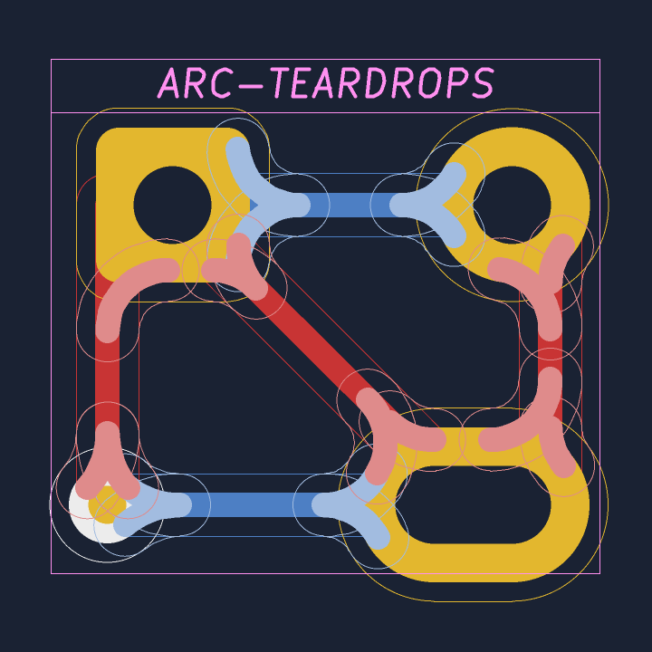

Arc teardrops plugin
====================

This [KiCad] 7 plugin generates tangential teardrops,
in the form of lightweight track arcs.
Check the [KiCad doc] for the installation paths.

This plugin is made and tested for the [Chrumm keyboard].
It may not meet general purpose requirements.

[KiCad]: https://www.kicad.org/
[KiCad doc]: https://dev-docs.kicad.org/en/python/pcbnew/
[Chrumm keyboard]: https://github.com/sevmeyer/chrumm-keyboard

Notes
-----

- Generated arcs are added to the "ARC-TEARDROPS" group
- Only straight track segments are considered
- Arcs are omitted if the track is too short or the pad too small
- If the arc radius is too big, there will be a copper gap
- The calculations are based on the polygon approximation of the pads
- The accuracy of the polygon approximation is influenced by
  "Board Setup" -> "Constraints" -> "Max allowed deviation"
